# Hotel Booking Demand — Exploratory Data Analysis

Exploratory data analysis on the Hotel Booking Demand dataset, done as part of a Data Science course assignment. The goal was to understand the dataset well enough to make informed decisions before any model gets built — not to build a model yet.

## Key numbers, for reference

| Metric | Value |
|---|---|
| Rows / columns | 119,390 / 32 |
| Training split | 95,512 rows (80%, stratified) |
| Target balance | ~63% not cancelled / ~37% cancelled (1.6:1) |
| Missing data concentrated in | `company` (~94%), `agent` (~14%) |
| Strongest categorical predictor | `deposit_type` (Cramér's V = 0.4827) |
| Strongest numerical predictor | `previous_cancellations` |
| Leakage AUC gap | 0.7299 (clean baseline) vs 1.0000 (with `reservation_status`) |
| Features engineered | 8 |
| Features dropped for leakage | `reservation_status`, `reservation_status_date` |

---

## Table of Contents
1. [Dataset](#dataset)
2. [Data Quality & Missing Values](#data-quality--missing-values)
3. [Target Variable & Imbalance](#target-variable--imbalance)
4. [Univariate Analysis: Numericals & Skewness](#univariate-analysis-numericals--skewness)
5. [Univariate Analysis: Categoricals & Cardinality](#univariate-analysis-categoricals--cardinality)
6. [Outlier Analysis](#outlier-analysis)
7. [Bivariate & Multivariate Relationships](#bivariate--multivariate-relationships)
8. [Temporal Patterns](#temporal-patterns)
9. [Data Leakage Discovery](#data-leakage-discovery)
10. [Feature Engineering](#feature-engineering)
11. [Running it](#running-it)

---

## Dataset
[Hotel Booking Demand](https://www.kaggle.com/datasets/jessemostipak/hotel-booking-demand), originally published by Antonio, Almeida and Nunes in *Data in Brief* (2019). 119,390 reservation records from a City Hotel and a Resort Hotel, covering arrivals between 2015 and 2017, 32 columns. The prediction target is `is_canceled` — whether the booking was eventually cancelled.

---

## Data Quality & Missing Values

Before analysis, a 20% stratified holdout was separated to prevent data leakage into preprocessing decisions. 

We found that missing data is almost entirely concentrated in two columns: `company` (~94% missing) and `agent` (~14% missing). `country` and `children` have negligible missingness.

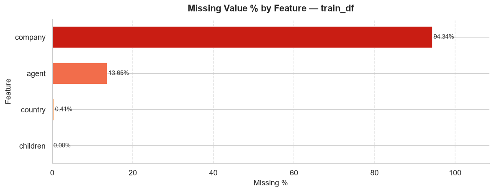
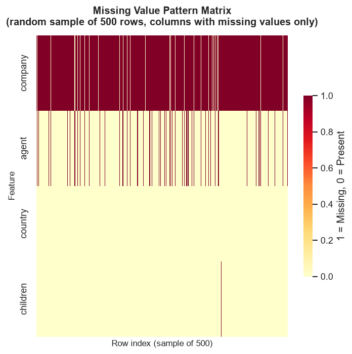

Further co-occurrence analysis revealed that `agent` and `company` are Missing At Random (MAR), heavily tied to direct bookings (which naturally lack an agent). Consequently, we impute them using binary flags (`agent_present`, `company_present`) rather than fabricating values.

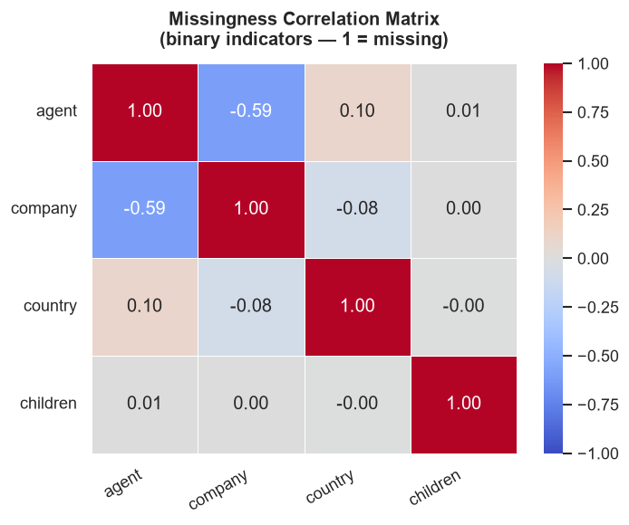

---

## Target Variable & Imbalance

The `is_canceled` target variable splits roughly 63/37 (not cancelled / cancelled) — a ratio of about 1.6:1. This is a moderate imbalance, which implies that accuracy alone is a misleading metric. However, it's not severe enough to mandate aggressive resampling like SMOTE; `class_weight='balanced'` in a model is mathematically sufficient.

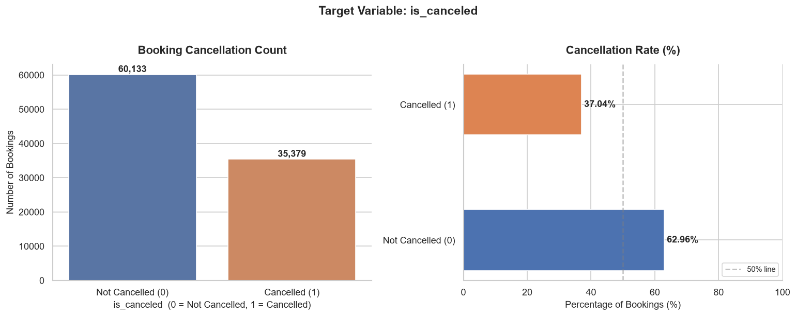

---

## Univariate Analysis: Numericals & Skewness

Distributions of the numerical features reveal significant right-skewness. Very few features follow a normal distribution. 

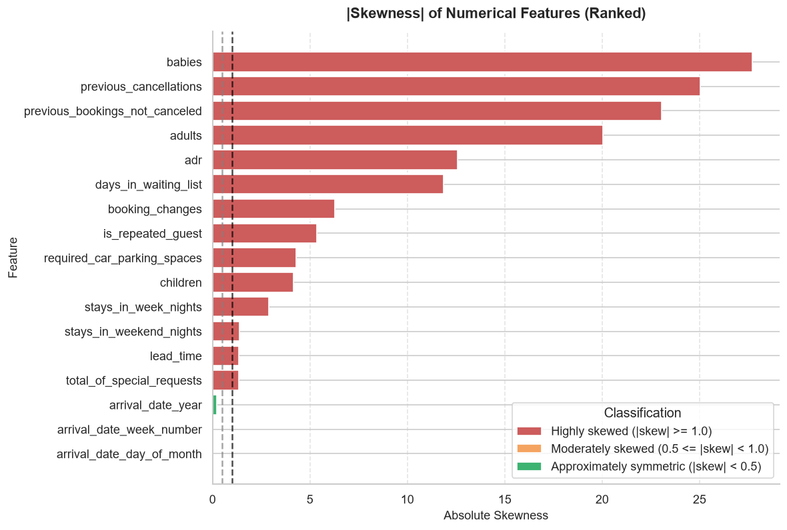

For example, `lead_time`, `previous_cancellations`, and `days_in_waiting_list` have long right tails. Below is the density and box plot for `lead_time`, showcasing the concentration of short-lead bookings but a massive tail stretching past 700 days.

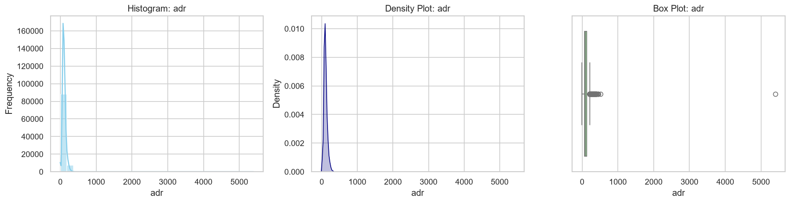
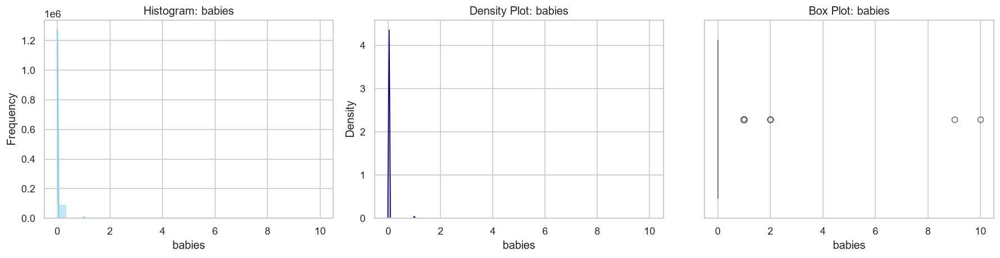

Because of this skewness, we rely on non-parametric tests (Mann-Whitney U) and robust transformations (Log1p + RobustScaler) rather than standard t-tests and Z-score scaling.

---

## Univariate Analysis: Categoricals & Cardinality

The categorical features vary wildly in cardinality. Low-cardinality features like `meal` and `market_segment` are easily one-hot encoded (after grouping rare categories under 1%).

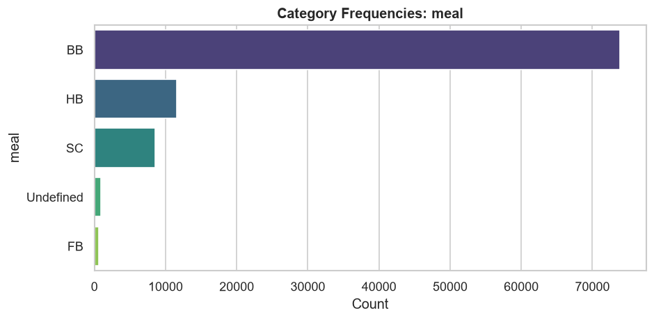
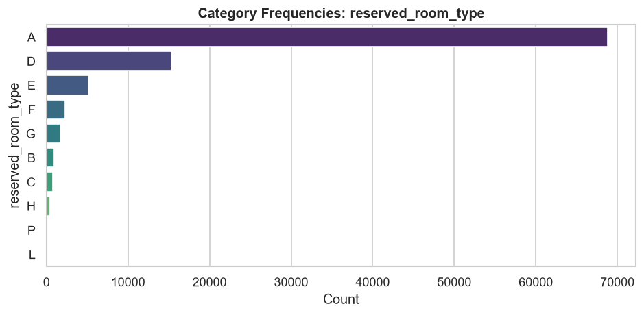

However, `country`, `agent`, and `company` possess massive cardinality (e.g., 160+ unique countries). One-hot encoding these would introduce hundreds of sparse columns. We recommend frequency or target encoding for these features during modeling.

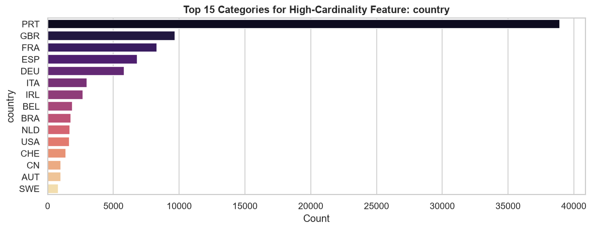

---

## Outlier Analysis

IQR-based outlier detection highlights features like `adr` (Average Daily Rate) and `lead_time`. Rather than blindly dropping outliers, we analyzed them: long `lead_time` values are valid advance group bookings. Negative `adr` values, however, are impossible physical rates and must be clipped to zero.

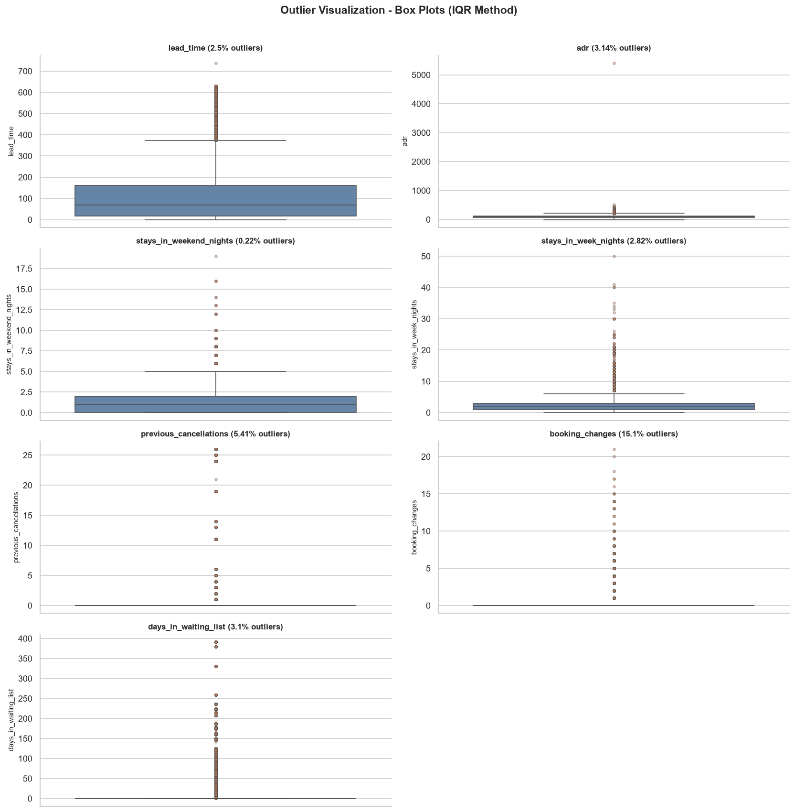

---

## Bivariate & Multivariate Relationships

### Feature-Feature Correlation
No problematic multicollinearity exists among the numerical variables (Pearson |r| does not exceed 0.7). 

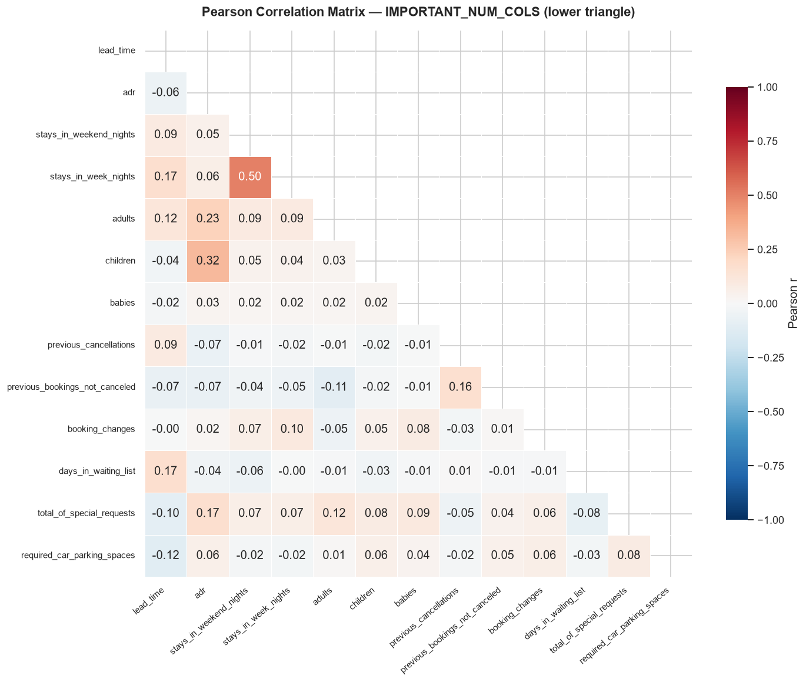
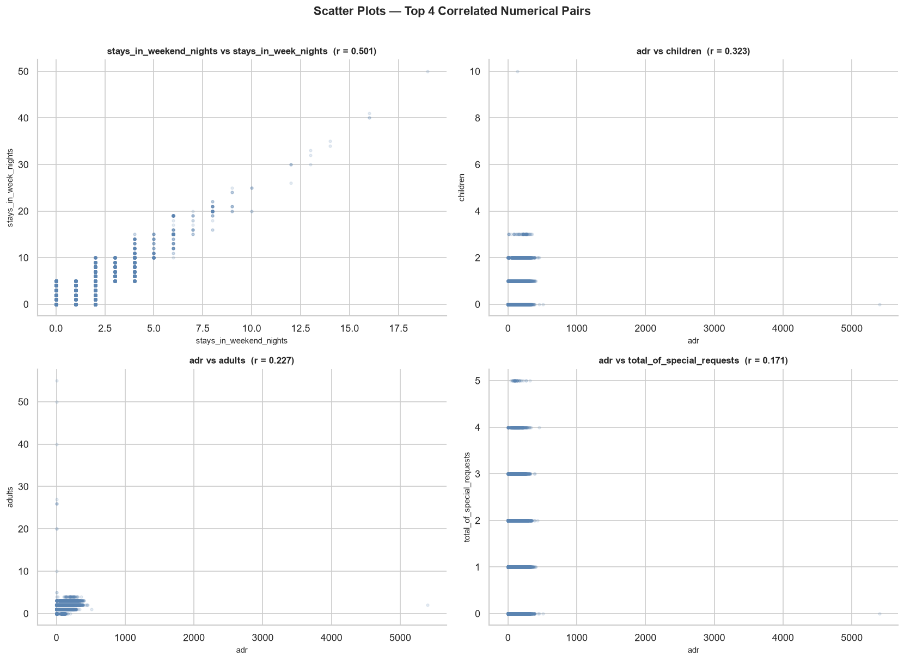

### Numerical vs Target
Plotting the numerical variables against the target reveals that longer `lead_time` and higher `previous_cancellations` correlate strongly with a higher likelihood of cancellation.

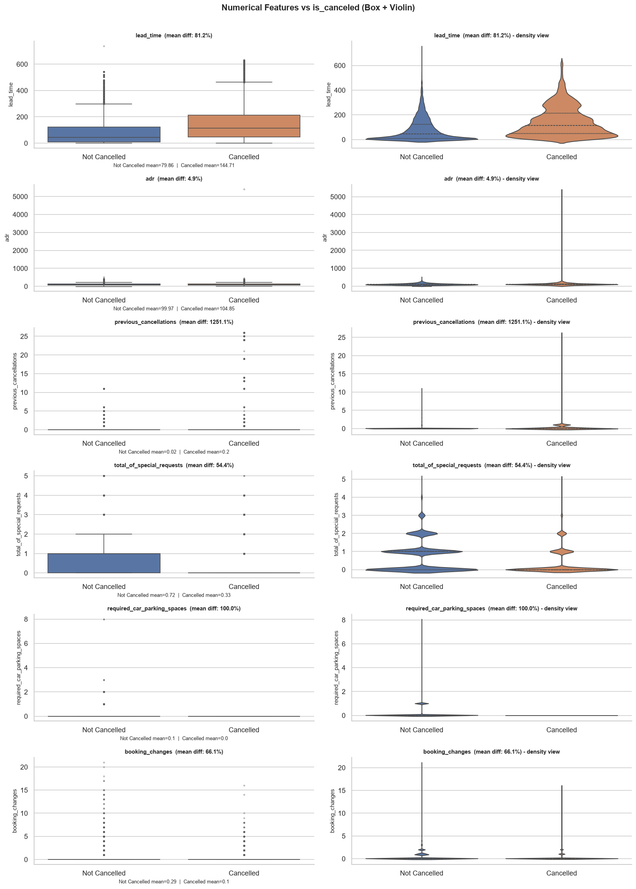

### Categorical vs Target
We analyzed the cancellation rate inside each categorical group. The most striking finding: `deposit_type = Non-Refund` paradoxically sees near-100% cancellation rates. 

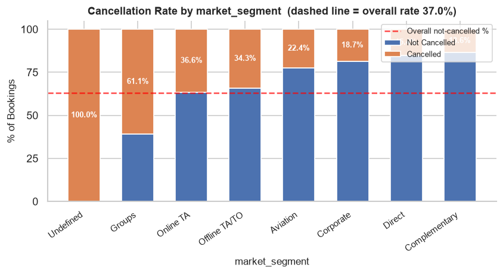
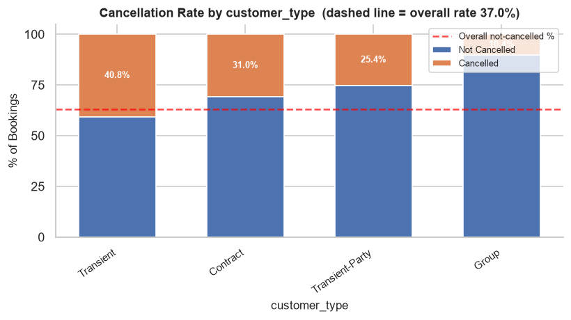

We investigated this counter-intuitive deposit finding with a multivariate heatmap (`deposit_type` x `market_segment` x `is_canceled`). It confirmed that this 100% cancellation behavior holds across almost *every* market segment. It is likely a booking-pattern artifact (e.g., agencies using non-refundable rates for speculative holds that inevitably drop).

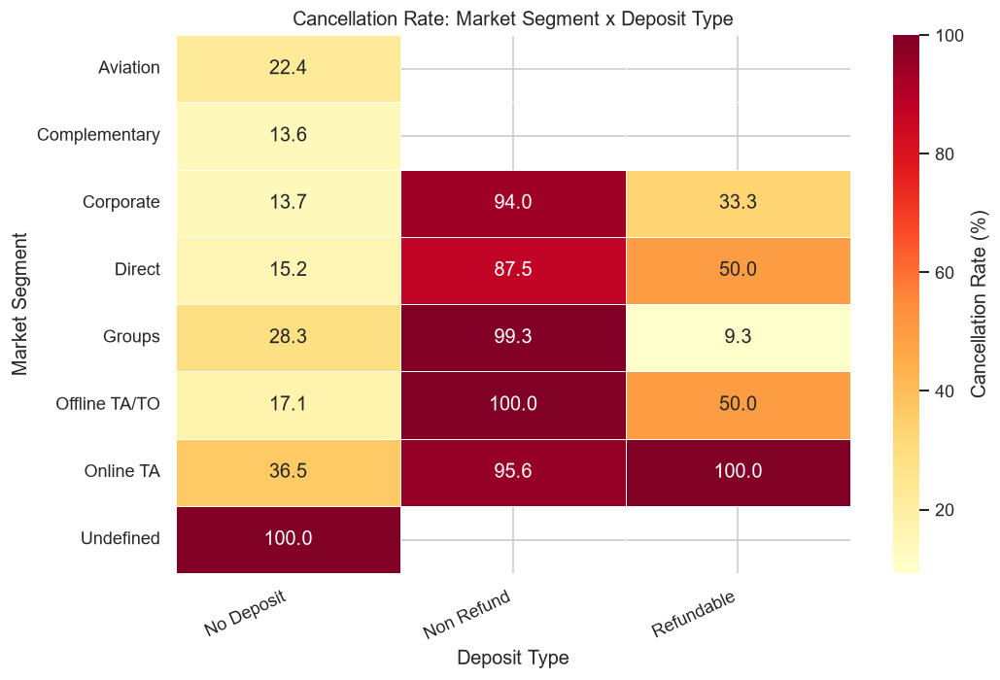

Other interesting three-way interactions included `lead_time` x `hotel`. The cancellation gradient across lead-time is much steeper for City Hotels than for Resort Hotels.

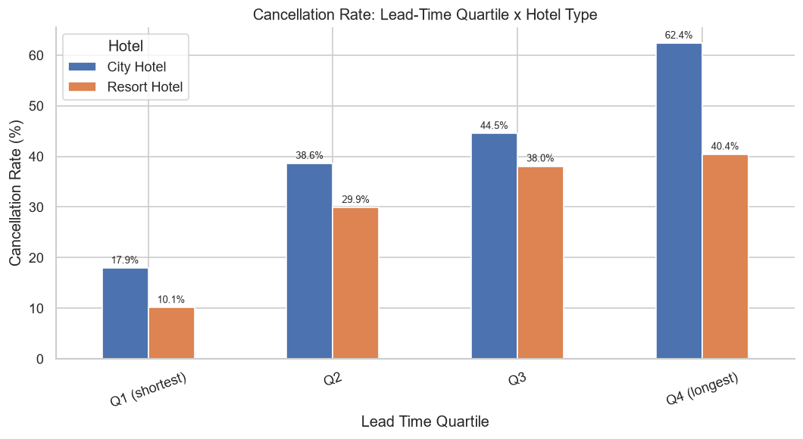

---

## Temporal Patterns

City Hotels and Resort Hotels experience completely different seasonal demands. 
- City Hotels peak steadily across spring to autumn.
- Resort Hotels see a sharper, distinct summer peak with a deep winter trough.

Interestingly, the highest *booking volume* months are not perfectly aligned with the highest *cancellation rate* months. High-demand summer slots accumulate long-lead-time bookings months in advance, causing elevated cancellation rates right before or during peak season.

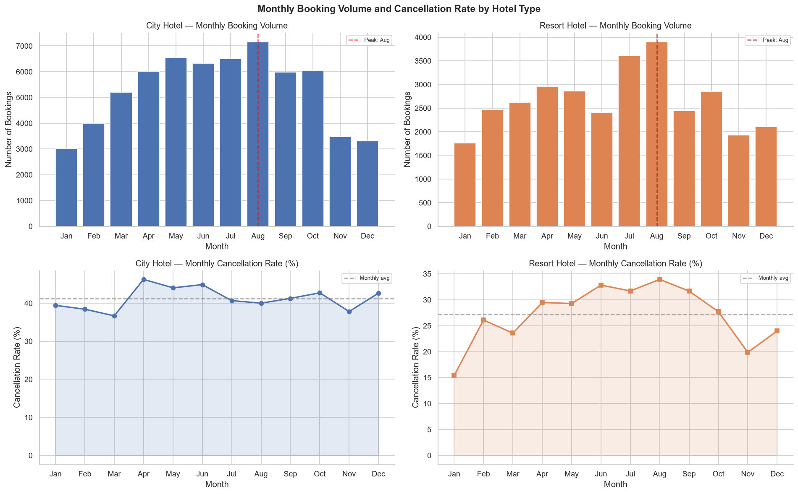
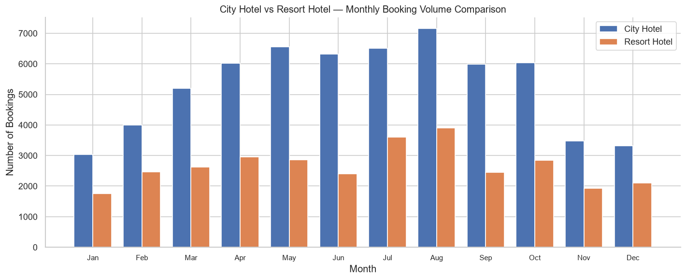

---

## Data Leakage Discovery

The most critical finding of the EDA: **`reservation_status` and `reservation_status_date` are severely leaky.** 
`reservation_status` perfectly encodes the target ("Canceled" maps to `is_canceled=1` in 100% of rows). We demonstrated this by training two Logistic Regression baselines:
- **Model A (with `reservation_status`)**: ROC-AUC = 1.0000. It reads the answer directly.
- **Model B (clean baseline)**: ROC-AUC = 0.7299. A realistic starting point.

Both features represent post-outcome knowledge that would *never* be available at the time of booking. They must be unconditionally dropped before modeling.

---

## Feature Engineering

Based on the EDA, we engineered 8 new features and validated their Point-Biserial/Cramér's V correlation with `is_canceled`. Some key additions:
- `prev_cancel_ratio`: A smoothed ratio of past cancellations. This showed a stronger numerical signal than any individual raw feature.
- `room_match`: A binary indicator of whether the assigned room matched the reserved room (a proxy for check-in satisfaction/downgrades).
- `is_long_lead_time`: A binary flag using the statistically computed IQR upper bound from our outlier analysis.
- `total_stay`, `booking_interaction_score`, etc.

The full Preprocessing Recommendation Report in the notebook maps every one of these findings into a concrete modeling action (what to clip, impute, encode, scale, and drop).

---

## Running it

The notebook auto-detects its environment — it checks for the Kaggle input path first, then falls back to `data/hotel_bookings.csv` locally, so it runs unmodified in both places.

- **Kaggle**: upload `ML_Ex01_EDA.ipynb`, add the `hotel-booking-demand` dataset as input, Run All.
- **Local**: `pip install pandas numpy matplotlib seaborn scipy scikit-learn`, then run the notebook normally. The dataset is already in `data/`.

## Structure

```
.
├── ML_Ex01_EDA.ipynb     # the full analysis
├── data/
│   └── hotel_bookings.csv
├── readme_assets/        # extracted visualizations
└── README.md
```